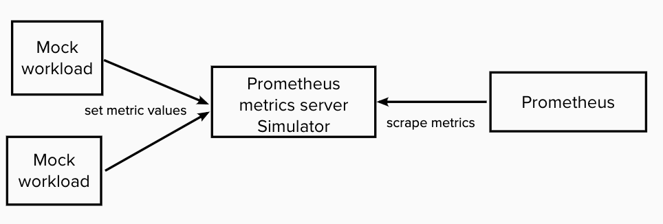
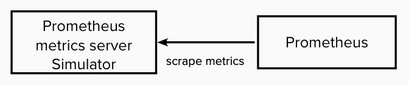

# prometheus-metrics-server-exmaple

A configurable prometheus metrics server simulator. It can be configured to generate different number of metrics with different labels. An example is file `example/config.yaml`. In `example/openshift.yaml` it demos how to generate configmap for it..

# User Cases
1. It can be used as metrics endpoint/gateway of workload by setting metric values via http API 
   
     
2. It can be used to stress Prometheus by generating any number of metrics  
   
   
3. It can be helpful for applications Grafana dashboard develop by creating mock metrics
   

# Steps
1. Install Openshift and IBM Bedrock Monitoring Service
2. Optionally you can edit the configmap defined in `example/openshift.yaml` file to change generated metrics.
3. `oc create -f example/openshift.yaml`
4. Open `<CP console>/prometheus` to check the existence of metrics

# Configration syntax
```
counters:
  - prefix: mock_metric_counter
    number: 3
    labels:
    - name: app
      valueset:
      - "prometheus-mock-metrics-server"
    - name: client_addr
      valueset:
      - "client1"
      - "client2"
      - "client3"
  - prefix: mock_metric_request_total
    labels:
    - name: app
      valueset:
      - "prometheus-mock-metrics-server"
    valuemode: http
    
gauges:
  - prefix: mock_metric_gauges
    number: 4
    range:
      upper: 1000
      lower: 2
    labels:
    - name: app
      valueset:
      - "prometheus-mock-metrics-server"
    - name: client_addr
      valueset:
      - "client1"
      - "client2"
      - "client3"
```
In the default configuration yaml above, you can see,
1. You can configure Counter metrics and Gauge metrics
2. `prefix` is metric name prefix. When `number` is 1 it is exactly metric name. When `number` is greater than 1 metric names will be `<prefix>-index`. `index` is [0,`number`)
3. label.name is the label name. label.valueset is the label value set. It will select randomly from them as label value.
4. `number` is exact metric series number. But series are not fixed as label values are selected randomly.
5. Guage metrics' value will change randomly in between upper value and lower value when valuemode is auto.
6. `valuemode` can be `http` or `auto`. Default value is `auto`.
   - `http`  
      Metric value will be changed by `curl -XPUT http://localhost:8080/metrics/value -d "$data" -H "Content-Type: application/json" `. An example of payload is in `example/setvalue.json` file. Its value is real value for guage metric and increment for Counter value.
   - `auto`  
      Metric value will change randomly and automatically.